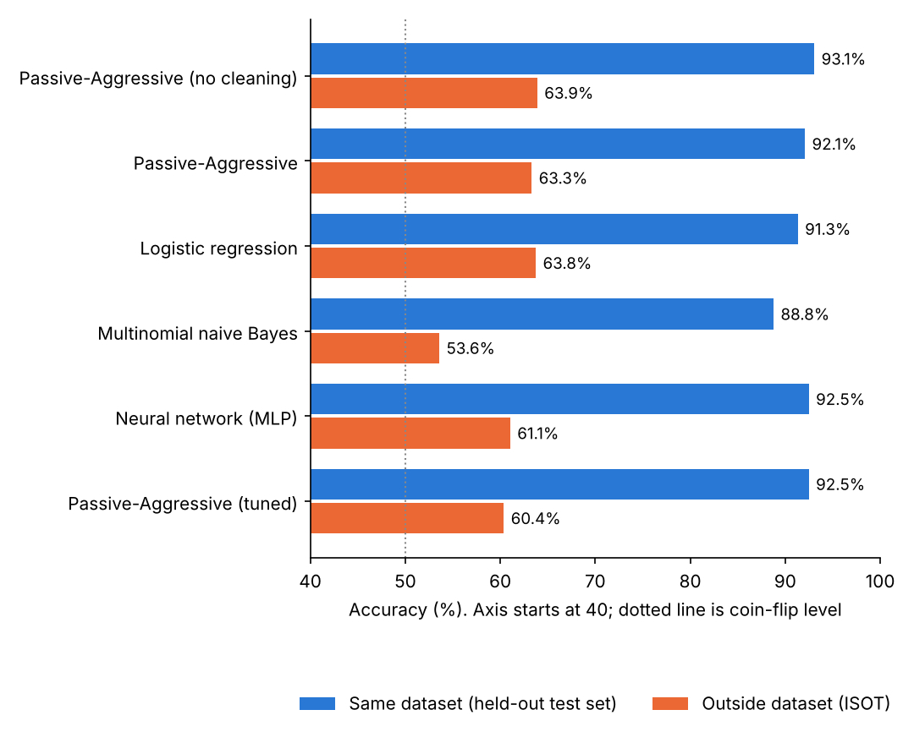
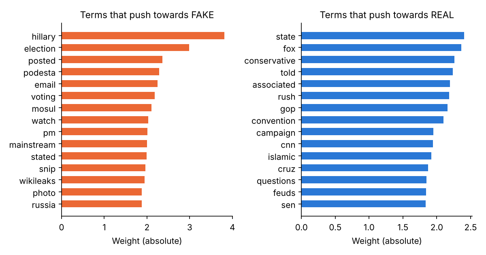

# Fake News Detection

Classifies news articles as **REAL** or **FAKE** from their text, using TF-IDF features and
a Passive-Aggressive linear classifier, with logistic regression, naive Bayes and a small
neural network for comparison. It also tests how well the result holds on a second dataset
the models never saw, and shows which words drive each prediction.

This is a 2026 rebuild of a class project I first did in January 2021 for a Neural Networks
and Fuzzy Control course during my Bachelor's degree. The original was the TF-IDF and
Passive-Aggressive pipeline. Everything else here was added in the rebuild.

## Headline result

**About 92% accurate on its own dataset, about 60% on a different one.**

The models learn the vocabulary and style of the outlets in the training data. That is
enough to separate articles from the same collection and not enough to recognise fake news
in general. The rest of this page shows how that was measured.



## Results

Main dataset: held-out test set of 1,212 articles (20%, stratified, seed 7), plus 5-fold
cross-validation on the training set. Outside dataset: all 38,639 ISOT articles, scored
with the same fitted models and no retraining.

| Model | Test accuracy | CV accuracy (mean ± sd) | Outside dataset | Differs from baseline? (p) |
|---|---:|---:|---:|---:|
| Passive-Aggressive, no cleaning | 93.1% | 92.9% ± 0.5 | 63.9% | 0.09 |
| **Passive-Aggressive (baseline)** | 92.1% | 91.9% ± 0.7 | 63.3% | n/a |
| Logistic regression | 91.3% | 91.8% ± 0.7 | 63.8% | 0.15 |
| Multinomial naive Bayes | 88.8% | 88.5% ± 0.5 | 53.6% | < 0.001 |
| Neural network (MLP, 64 hidden units) | 92.5% | 91.0% ± 1.1 | 61.1% | 0.61 |
| Passive-Aggressive, tuned (saved model) | 92.5% | 92.6% ± 0.6 | 60.4% | 0.59 |

All rows except the first use cleaned text. The last column is an exact McNemar test
against the baseline on the 1,212 test articles. The outside dataset is 55% REAL, so always
answering REAL would score 54.8% there.

What the table says:

- **Cleaning costs about one point** on the main dataset (93.1% to 92.1%). The removed dates
  and page boilerplate were doing some of the work.
- **Cleaning did not improve transfer.** Outside accuracy is about 63% with or without it.
  The shortcut words were a small part of the problem; the larger part is that each
  dataset's sources write about different things in different ways.
- **Only naive Bayes is clearly different from the baseline.** The neural network, logistic
  regression and the tuned model are statistically indistinguishable from it on this test
  set.
- **Tuning gained little.** A 24-combination grid search raised cross-validated accuracy
  from 91.9% to 92.6%, and the tuned model scored slightly lower on the outside dataset.
- **The reverse direction fails too.** A baseline trained on ISOT scores 97.1% on ISOT's own
  test split and 55.6% on the main dataset.

Confusion matrix of the saved model on the main test set (rows are actual, columns are
predicted):

| | Predicted FAKE | Predicted REAL |
|---|---:|---:|
| **Actual FAKE** | 578 | 36 |
| **Actual REAL** | 55 | 543 |

Full numbers are in [`results/metrics.json`](results/metrics.json) and
[`results/tuning.json`](results/tuning.json).

## What the model learns



After cleaning, the strongest FAKE terms are topics from the 2016 US election (`hillary`,
`podesta`, `wikileaks`, `email`) and blog furniture (`posted`, `watch`, `snip`). The
strongest REAL terms are reporting vocabulary (`told`, `associated`, `sen`) and mainstream
political coverage (`gop`, `convention`, `campaign`). The classifier separates two groups of
publishers. It does not check facts.

In practice:

- A false story written in a newswire style can be labelled REAL, and a true story in a
  blog style can be labelled FAKE.
- Accuracy on other topics, countries or years will be closer to the outside-dataset figure
  than to the headline one.
- It should not be used on its own to judge whether a specific article is true.

## Data

Neither dataset is stored in this repository; both are third-party article text.

| | Main dataset | Outside dataset |
|---|---|---|
| Name | `fake_or_real_news`, compiled by George McIntire | ISOT Fake News Dataset, University of Victoria |
| Save as | `data/news.csv` | `data/external/True.csv` and `data/external/Fake.csv` |
| Columns | `title`, `text`, `label` | `title`, `text`, `subject`, `date` (label comes from the file) |
| Rows | 6,335 | 44,898 |
| Removed: empty text | 36 | 631 |
| Removed: duplicate text | 241 | 5,628 |
| Rows used | 6,058 | 38,639 |

Duplicates are removed because copies of one article can fall on both sides of a split and
inflate the test score. `train.py` runs without the outside dataset and skips that part.

## Method

1. **Cleaning** ([`fakenews/cleaning.py`](fakenews/cleaning.py)). Removes cues to where and
   when an article was collected: links, wire datelines such as `WASHINGTON (Reuters) -`,
   photo-credit phrases, all numbers and years, month and weekday names, and page
   boilerplate words such as `share`, `print` and `advertisement`.
2. **Features.** `TfidfVectorizer` on single words, English stop words removed, words in
   more than 70% of articles dropped. Fitted on training data only.
3. **Baseline.** Passive-Aggressive classifier (PA-I, `C=1`, 50 passes): an online linear
   model that leaves its weights alone when a prediction is correct and corrects them just
   enough when it is wrong. Built through `SGDClassifier` on scikit-learn 1.8 and later,
   where the older `PassiveAggressiveClassifier` class is deprecated, and through that class
   on earlier versions.
4. **Comparison models.** Logistic regression (`C=10`), multinomial naive Bayes
   (`alpha=0.1`), and an `MLPClassifier` with one hidden layer of 64 units and early
   stopping on the 20,000 most frequent terms.
5. **Tuning** ([`tune.py`](tune.py)). Grid search over word pairs, sublinear term frequency,
   `max_df` and `C`, scored by 5-fold cross-validation on the training set. It selects the
   simplest setting within one standard deviation of the best score. Here that is single
   words, `max_df=0.5`, sublinear term frequency and `C=0.1`.
6. **Evaluation.** Accuracy, per-class precision, recall and F1, and a confusion matrix on
   the held-out test set; cross-validation on the training set; an exact McNemar test
   between each model and the baseline; and the outside-dataset test in both directions.
7. **Explanations** ([`fakenews/explain.py`](fakenews/explain.py)). For a linear model, each
   word's contribution is its TF-IDF value in the article times its learned weight. The
   contributions plus the intercept equal the decision margin exactly.

## Run it

```bash
pip install -r requirements.txt
python tune.py        # optional, about 10 minutes on 2 cores; writes results/tuning.json
python train.py       # about 5 minutes; writes results/ and models/
```

Classify an article from the command line:

```console
$ python predict.py "BREAKING: You won't believe what Hillary's emails reveal about the globalist elites"
FAKE  (margin -2.54; negative leans FAKE, positive leans REAL, near 0 is uncertain)
Words pushing towards FAKE: hillary (-0.71), breaking (-0.66), elites (-0.34), globalist (-0.28), reveal (-0.26)
Words pushing towards REAL: emails (+0.20), won (+0.06), believe (+0.01)
```

`python predict.py --file article.txt --top 12` reads from a file and lists more words.

Web demo:

```bash
streamlit run app.py
```

Tests:

```bash
pip install pytest
pytest
```

The tests use a small generated corpus, so they need no dataset. GitHub Actions runs them on
every push.

## Files

| Path | Purpose |
|---|---|
| `fakenews/` | Package: `cleaning`, `data`, `models`, `evaluate`, `explain` |
| `train.py` | Trains and evaluates all models, runs the outside-dataset test, writes results |
| `tune.py` | Grid search for the baseline |
| `predict.py` | Command-line prediction with the words behind it |
| `app.py` | Streamlit web demo |
| `tests/` | Unit tests |
| `results/` | `metrics.json`, `tuning.json` and the figures |
